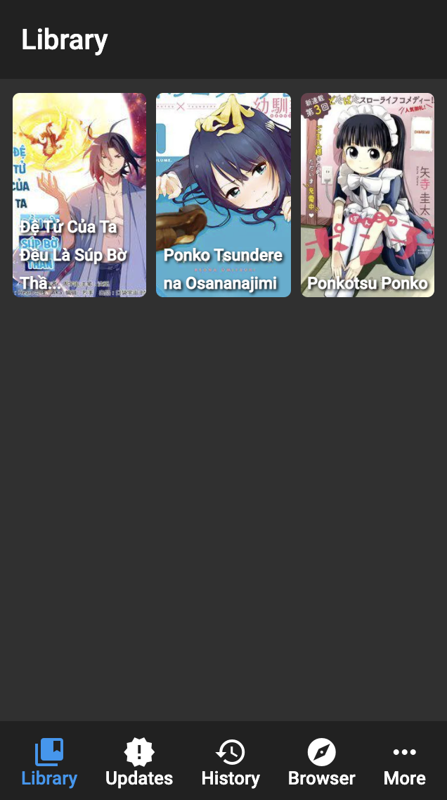
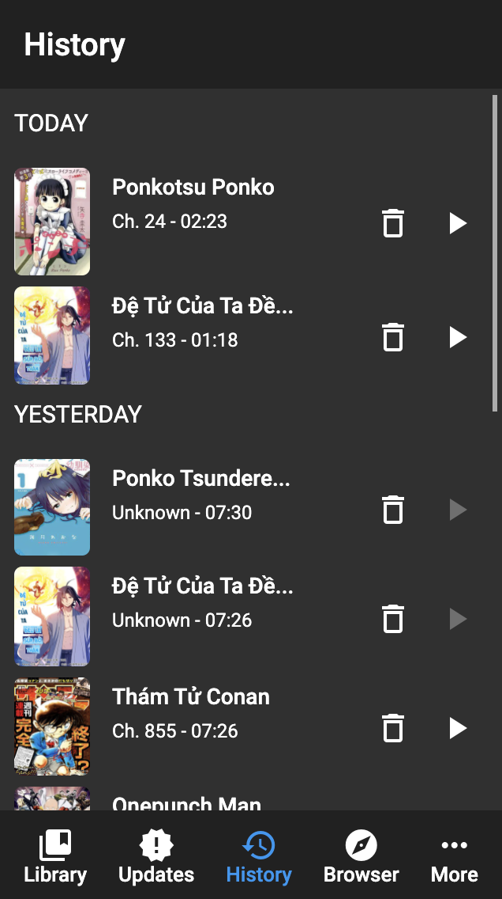
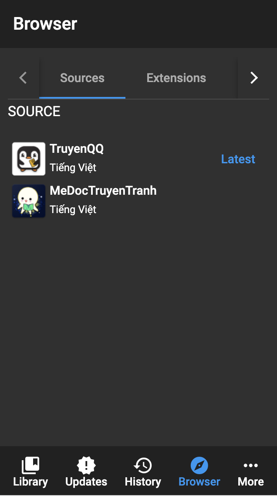
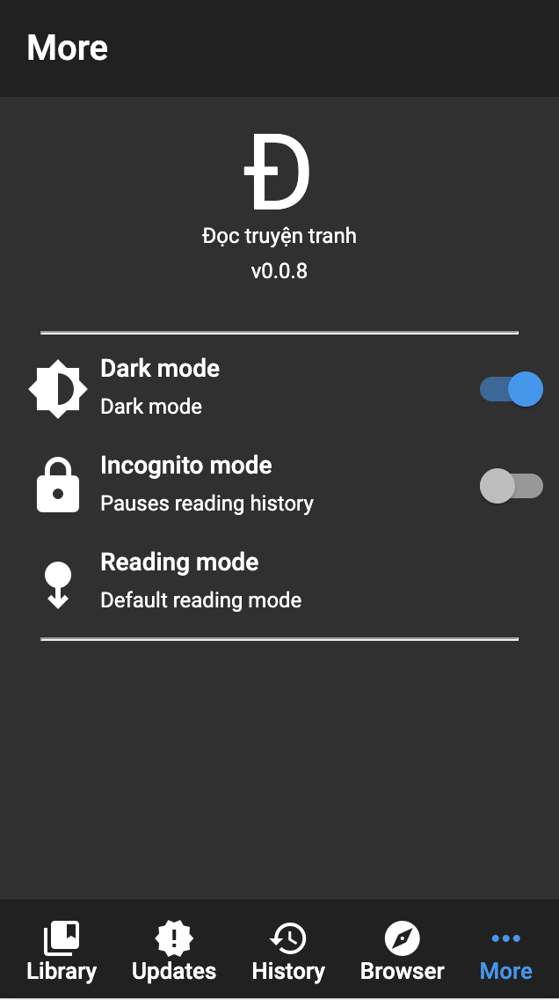

# Dotru

This project was generated with [Angular CLI](https://github.com/angular/angular-cli) version 12.2.4.

### Apps

Visit app at: https://hajaulee.github.io/dotru/

### Screenshot

  
### Extensions repo

https://github.com/hajaulee/dotru-extensions

## Development server

Run `ng serve` for a dev server. Navigate to `http://localhost:3000/`. The app will automatically reload if you change any of the source files.
